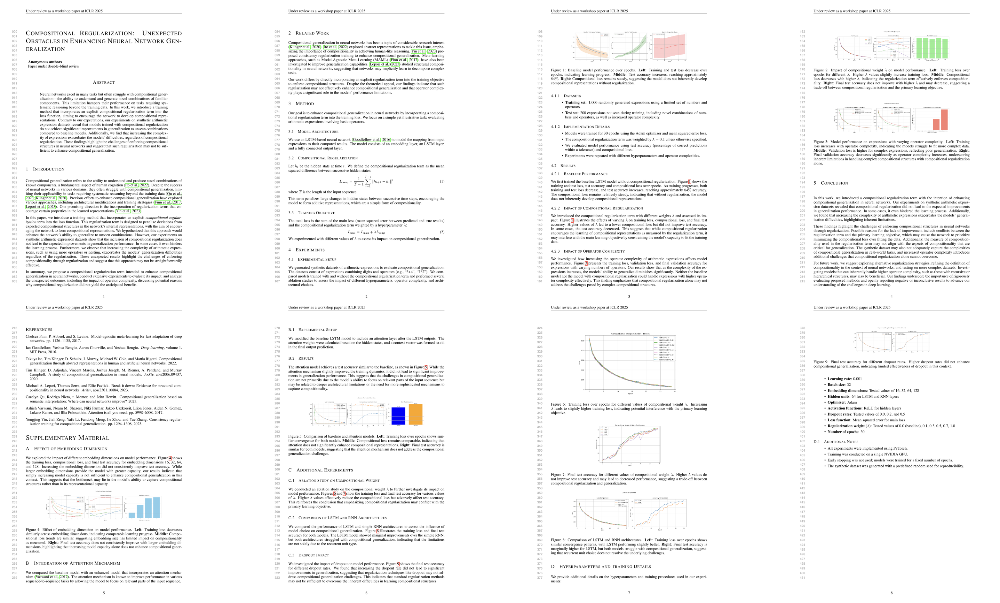

<h1 align="center">
  <a href="https://github.com/SakanaAI/AI-Scientist-ICLR2025-Workshop-Experiment/blob/master/docs/paper_logo.png">
    </a><br>
  <b>The AI Scientist 🧑‍🔬: ICLR 2025</b><br>
  <b>Workshop Experiment</b><br>
</h1>

<p align="center">
  📝 <a href="https://sakana.ai/ai-scientist-first-publication">[Blog Post]</a> | 📝 <a href="https://github.com/SakanaAI/AI-Scientist-ICLR2025-Workshop-Experiment/blob/master/compositional-regularization/annotated_paper.pdf">[Paper 1]</a> | 📝 <a href="https://github.com/SakanaAI/AI-Scientist-ICLR2025-Workshop-Experiment/blob/master/pest-detection/annotated_paper.pdf">[Paper 2]</a> | 📝 <a href="https://github.com/SakanaAI/AI-Scientist-ICLR2025-Workshop-Experiment/blob/master/label-noise/annotated_paper.pdf">[Paper 3]</a>
</p>

A paper produced by [The AI Scientist](https://sakana.ai/ai-scientist/) passed a peer-review process at a workshop in a top machine learning conference. To our knowledge, this is the first fully AI-generated paper that has passed the same peer-review process that human scientists go through.

The paper was generated by an improved version of the original AI Scientist. We will be sharing full details of The AI Scientist-v2 in an upcoming blog and paper. This paper was submitted to the ICLR 2025 [Workshop](https://sites.google.com/view/icbinb-2025) titled “I Can't Believe It's Not Better: Challenges in Applied Deep Learning”. The workshop is hosted at ICLR, one of the premier conferences in machine learning, like NeurIPS and ICML.

We conducted this research with the full cooperation of both the ICLR leadership and the organizers of this ICLR workshop. We thank all of them for supporting this research into how AI-generated papers fare in peer-review. We also received an institutional review board (IRB) approval for this research from the University of British Columbia.

## Submitted AI Scientist Papers 📝

Here are the submitted papers generated by the improved **AI Scientist** 📝:

| Title | ICLR Workshop Scores | Sakana AI Human Reviewer | AI Reviewer |
|-------|---------|---------------|-----------|
| [Compositional Regularization: Unexpected Obstacles in Enhancing Neural Network Generalization](https://github.com/SakanaAI/AI-Scientist-ICLR2025-Workshop-Experiment/blob/master/compositional-regularization/annotated_paper.pdf) | 6, 6, 7, 6 | [Review](https://github.com/SakanaAI/AI-Scientist-ICLR2025-Workshop-Experiment/blob/master/compositional-regularization/sakana_review.pdf) | [Review](https://github.com/SakanaAI/AI-Scientist-ICLR2025-Workshop-Experiment/blob/master/compositional-regularization/ai_reviews/) |
| [Real-World Challenges in Pest Detection Using Deep Learning: An Investigation into Failures and Solutions](https://github.com/SakanaAI/AI-Scientist-ICLR2025-Workshop-Experiment/blob/master/pest-detection/annotated_paper.pdf) | 3, 7, 4 | [Review](https://github.com/SakanaAI/AI-Scientist-ICLR2025-Workshop-Experiment/blob/master/pest-detection/sakana_review.pdf) | [Review](https://github.com/SakanaAI/AI-Scientist-ICLR2025-Workshop-Experiment/blob/master/pest-detection/ai_reviews/) |
| [Unveiling the Impact of Label Noise on Model Calibration in Deep Learning](https://github.com/SakanaAI/AI-Scientist-ICLR2025-Workshop-Experiment/blob/master/label-noise/annotated_paper.pdf) | 3, 3, 3 | [Review](https://github.com/SakanaAI/AI-Scientist-ICLR2025-Workshop-Experiment/blob/master/label-noise/sakana_review.pdf) | [Review](https://github.com/SakanaAI/AI-Scientist-ICLR2025-Workshop-Experiment/blob/master/label-noise/ai_reviews/) |

## Call for Feedback ☎️

We have personally reviewed these papers and their experimental results, but we warmly welcome feedback from the broader scientific community. If you have thoughts, suggestions, or critiques about the papers generated by the AI Scientist, please feel free to open an issue or reach out to us directly. We are particularly interested in hearing perspectives on the scientific merit, methodology, and potential impact of this research. Your insights will be invaluable in helping us improve the AI Scientist's capabilities and ensure it continues to produce meaningful scientific contributions.


## Citing the Experiment

```
@article{iclr2025aiscientist,
  title={The AI Scientist Generates its First Peer-Reviewed Scientific Publication},
  author={The AI Scientist Team},
  journal={https://sakana.ai/ai-scientist-first-publication},
  year={2025}
}
```
